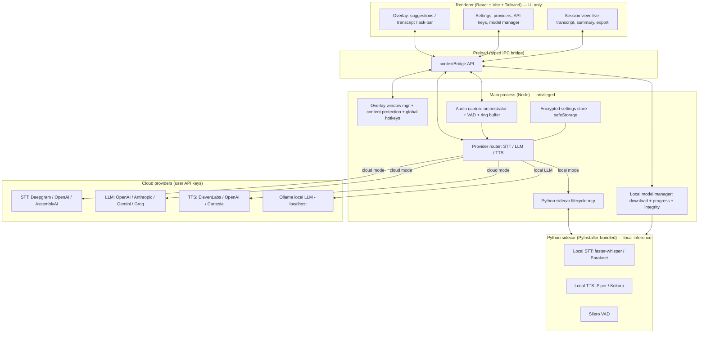

# Architecture

This document is the live technical reference for opencue. It is updated every phase.

## Goals

1. **Real-time meeting copilot** — capture meeting audio, transcribe, push context to an LLM, render assistance in an unobtrusive overlay, optionally speak responses.
2. **Two interchangeable modes** — *Cloud* (user-supplied API keys, lowest setup, highest quality) and *Local* (downloadable models, fully offline).
3. **Cross-platform** — Windows + macOS first, Linux best-effort. Per-OS native code is hidden behind adapters.
4. **Secure by default** — `contextIsolation` on, `nodeIntegration` off, strict CSP, encrypted secrets, no telemetry.

## High-level system



## Process model

opencue follows the standard hardened-Electron three-process layout:

| Process | Trust | Role | Allowed APIs |
| --- | --- | --- | --- |
| **Main** (`src/main/`) | Privileged | Window management, native APIs, IPC handlers, audio orchestration, sidecar lifecycle, provider router | Full Node + Electron |
| **Preload** (`src/preload/`) | Sandboxed bridge | Translates the typed IPC contract into a frozen `window.opencue` API exposed via `contextBridge` | Only what is needed to invoke channels |
| **Renderer** (`src/renderer/`) | Untrusted | All UI (React + Tailwind), zero native access — ESLint enforces no `electron`/`node:*` imports | Browser APIs + `window.opencue` |

`webPreferences` are: `contextIsolation: true`, `nodeIntegration: false`, `sandbox: true`, `webSecurity: true`. The renderer is served via a strict CSP that allows only `self`-served scripts.

## The IPC contract

Every cross-process call is declared once in [`src/shared/ipc-contract.ts`](../src/shared/ipc-contract.ts):

1. A channel string is added to the `IpcChannel` const-object.
2. Request/response payload shapes are added to `IpcContract`.
3. A handler is registered in `src/main/ipc.ts` (the main process).
4. The channel is exposed through the preload bridge in `src/preload/index.ts`.
5. The corresponding method is added to the `OpencueBridge` interface so the renderer gets full typing on `window.opencue`.

There are no ad-hoc string channels anywhere else — `grep` for `ipcRenderer.invoke` and `ipcMain.handle` should hit only these two files.

## Overlay window (Phase 1)

The overlay is a second `BrowserWindow` created and owned by `src/main/overlay/overlay-window.ts`. It is:

| Property | Value | Why |
| --- | --- | --- |
| `frame: false` | yes | Custom chrome / draggable header |
| `transparent: true` | yes | Rounded translucent card sits on top of any window |
| `hasShadow: false` | yes | Required when `transparent` is on for clean compositing |
| `alwaysOnTop: true` | yes | Floats above other apps; `'screen-saver'` level on macOS so it survives full-screen |
| `skipTaskbar: true` | yes | Doesn't pollute the dock / taskbar |
| `setContentProtection(true)` | yes | **Signature feature** — excluded from screen capture & recording (Win + macOS). Toggle in settings. |
| `setVisibleOnAllWorkspaces(true, { visibleOnFullScreen: true })` (macOS) | yes | Survives Spaces / full-screen swap |
| `webPreferences.sandbox: true` | yes | Same hardening as the main window |

The overlay UI is a separate React tree (`src/renderer/src/overlay/Overlay.tsx`). The same renderer build serves both windows; the main process appends `?view=overlay` to the URL so `main.tsx` can mount the correct root component.

Move + resize events are debounced (250 ms) and persisted to the settings store so the overlay remembers its last position across launches.

### Click-through

When `clickThrough` is on, `setIgnoreMouseEvents(true, { forward: true })` makes the overlay invisible to the mouse so the user can interact with whatever is beneath it. Hovering or clicking still wakes the overlay's window-level events, just not its DOM.

## Global hotkeys (Phase 1)

`src/main/hotkeys/hotkey-manager.ts` wraps Electron's `globalShortcut`. The renderer never sees an accelerator string at runtime — only **named actions** (`HotkeyAction` enum). The manager:

1. Loads the user-configured map from settings on boot (`applyAll`).
2. Re-registers atomically when the user updates a binding.
3. Emits a typed `trigger` event when a hotkey fires; the IPC layer relays it as the `event:hotkey-triggered` push to every renderer.

Six actions ship with sane defaults — see the table in the README. The manager surfaces per-action `HotkeyRegistrationResult`s (with the OS error message when registration fails so the UI can guide the user to pick a different combo).

## Settings & secret storage (Phase 1)

| Layer | File | Encryption | What lives there |
| --- | --- | --- | --- |
| Public preferences | `opencue-settings.json` (user-data dir) | none (plain JSON) | overlay state, hotkey map, schema version |
| Secrets | `opencue-secrets.json` (user-data dir) | **`safeStorage`** — Keychain / DPAPI / libsecret | API keys (Phase 3+), never logged |

Both stores live in `src/main/settings/store.ts`. The renderer never reads or writes them directly — only through typed IPC handlers. The schema and its migrations live in `src/shared/settings-schema.ts` (pure TypeScript, no Electron dep) so both processes and the test runner can import it.


```text
SystemAudioCapture (per-OS adapter)
        │
        ▼
   raw PCM frames ──► Silero VAD ──► speech segments
                                          │
                                          ▼
                                   ring buffer + transcript window
                                          │
                                          ▼
                              STT provider (cloud stream or local sidecar)
```

Per-OS implementations:

- **Windows** — WASAPI loopback (capture the system mix).
- **macOS** — ScreenCaptureKit audio (macOS 13+) via `desktopCapturer` / `getDisplayMedia` with `chromeMediaSource: 'desktop'`. On older macOS we fall back to a documented BlackHole / Loopback virtual audio device.
- **Linux** — PulseAudio / PipeWire monitor source on the active sink.

If a platform cannot do loopback (or the user denies permission), opencue falls back to mic + single-tab capture and tells the user clearly. The picker UI lets the user select source(s) at runtime.

## Audio pipeline (Phase 2)

```text
SystemAudioCapture (per-OS adapter — renderer)
        │
        ▼
   raw PCM frames ──► Silero VAD (onnxruntime-web)
                        │
                        ▼
                   speech segments ──► ring buffer
                        │                  │
                        ▼                  │
                  level meter (20 Hz)      │
                        │                  ▼
                        └─► IPC ─► main process orchestrator
                                       │   │
                                       ▼   ▼
                               state events / segment events
                               (broadcast to every renderer)
```

Owners:

- **Renderer (`src/renderer/src/audio/`)** acquires the `MediaStream` via `acquireAudioStream` (`getUserMedia` for mics, `getDisplayMedia` for screen / window). `CaptureController` then drives the live AnalyserNode loop (RMS / peak / dBFS at ~20 Hz) and Silero VAD (`createSileroVad`). Pure helpers (`RingBuffer`, `rms`, `peak`, `toDbFs`, `dbFsToMeter`) are covered by unit tests.
- **Main (`src/main/audio/audio-orchestrator.ts`)** enumerates desktop sources via `desktopCapturer`, installs the one-shot `setDisplayMediaRequestHandler` that returns the chosen source with `audio: 'loopback'`, tracks the canonical `AudioCaptureState` (`idle`/`requesting`/`active`/`error`), and broadcasts state, level ticks, and segment metadata over the typed IPC events.

Per-OS implementations:

- **Windows** — Chromium's WASAPI loopback path inside `getDisplayMedia` when a screen / window source is supplied via the display-media handler.
- **macOS** — ScreenCaptureKit (macOS 13+) under the same Chromium API. Requires Screen & System Audio Recording permission; `systemPreferences.getMediaAccessStatus('screen')` is surfaced over IPC so the picker can show a permission CTA instead of a generic error.
- **Linux** — Native loopback through `desktopCapturer` is not reliable, so `loopbackSupported('linux')` returns `false`. The UI hides screen / window options and tells the user to pick a microphone or a *Monitor of …* PulseAudio / PipeWire source.

The VAD model (Silero v5) and onnxruntime-web WASM files are copied into the renderer build under `/vad/` by `vite-plugin-static-copy` (see `electron.vite.config.ts`).

Raw PCM never crosses the IPC bridge in Phase 2 — only segment **metadata** (id, timestamps, sample count, RMS) is shipped. Bulk audio stays in-renderer for the future STT consumer (Phase 3) to read directly via a shared buffer or to push to a cloud streaming endpoint.

## Providers & Assist (Phase 3)

Once an STT segment is ready in the renderer, it is shipped to the main process and run through the user's chosen provider stack:

```text
VAD segment (renderer) ──base64 PCM──► AssistOrchestrator (main)
                                            │
                                            ▼
                                       STT provider
                                            │  text
                                            ▼
                                   TranscriptBuffer
                                            │
                                            ▼  (on Assist hotkey / Ask form)
                                       LLM provider (streaming)
                                            │  deltas
                                            ▼
                          IPC events ──► overlay + main UI
                                            │  done
                                            ▼ (optional)
                                       TTS provider
                                            │  audio bytes
                                            ▼
                          IPC event  ──► renderer plays via <audio>
```

Each capability sits behind a small interface — `SttProvider`, `LlmProvider`, `TtsProvider` (see `src/shared/provider-types.ts`). Cloud providers shipped in this phase:

| Capability | Providers |
| --- | --- |
| STT | OpenAI Whisper, Deepgram, AssemblyAI |
| LLM | OpenAI, Anthropic, Google Gemini, Groq |
| TTS | OpenAI, ElevenLabs |

The `ProviderRouter` (`src/main/providers/router.ts`) constructs the active provider per call by reading the user's `ProviderSelection` from settings — switching providers at runtime is free, no restart needed. Local STT / LLM / TTS lands in Phase 4 behind the same interfaces (faster-whisper / Parakeet, Piper / Kokoro, Ollama).

### Where keys live

API keys are entered in the **Providers & API keys** panel and stored encrypted with Electron `safeStorage` (Keychain / DPAPI / libsecret). The renderer never receives the key text back — only a `{ scope.providerId: hasKey }` presence map for the lock indicator. If `safeStorage` isn't available on the host, opencue refuses to save the key rather than fall back to plaintext.

`.env.example` lists the same variables for developer convenience, but real `.env` is git-ignored and the runtime never reads it.

## Provider abstraction (planned — Phase 3)

```text
STTProvider  ─┐
LLMProvider  ─┼─►  Router (reads encrypted settings) ─► active backend
TTSProvider  ─┘
```

Each provider is implemented behind an interface. Switching cloud ↔ local is a runtime setting change; no restart required. Provider selection plus model name plus API key are stored encrypted via Electron `safeStorage` on top of `electron-store`.

## Local inference sidecar (planned — Phase 4)

A small **Python sidecar** runs locally and exposes a localhost WebSocket / JSON-RPC. The main process owns its lifecycle (spawn, health-check, graceful shutdown). It loads:

- **faster-whisper** & **NVIDIA Parakeet** for STT,
- **Piper** & **Kokoro** for TTS,
- **Silero** for VAD.

Models are not bundled. The main-process **model manager** downloads them on demand, streams real progress (bytes / total / speed / ETA) to the renderer, verifies checksums, and stores them under the app's user-data directory.

> Parakeet is an ASR (speech-to-text) family, so it appears under STT — not TTS. The model manager treats every model uniformly; this only affects which dropdown the model is offered in.

## Security model

- **No secrets in the repo.** `.env.example` only; real `.env` is git-ignored. User API keys live in encrypted settings; they are never logged and never sent to any server we control.
- **Strict CSP** on the renderer (see `src/renderer/index.html`).
- **IPC input validation** — every handler validates its payload before acting.
- **Overlay content protection** — `BrowserWindow.setContentProtection(true)` so the overlay is excluded from screen capture / recording (Phase 1).

## Build & release (planned — Phase 7)

`electron-builder` produces Windows (NSIS), macOS (dmg), and Linux (AppImage / deb) artifacts in CI. The Python sidecar is bundled per-platform via PyInstaller. `electron-updater` ships updates from GitHub Releases. Signing & notarization steps are documented in `README.md` and `CONTRIBUTING.md`.

## Repository layout

```
.
├── docs/
│   ├── ARCHITECTURE.md     # this file
│   └── BUILD_PROMPT.md     # the master spec
├── src/
│   ├── main/               # Electron main process (privileged)
│   │   ├── index.ts
│   │   ├── ipc.ts
│   │   ├── audio/
│   │   │   ├── audio-orchestrator.ts
│   │   │   └── audio-orchestrator.test.ts
│   │   ├── overlay/
│   │   │   ├── overlay-window.ts
│   │   │   └── overlay-window.test.ts
│   │   ├── hotkeys/
│   │   │   └── hotkey-manager.ts
│   │   └── settings/
│   │       └── store.ts            # electron-store + safeStorage
│   ├── preload/            # contextBridge — ONLY path to the renderer
│   │   └── index.ts
│   ├── renderer/           # React UI — no Node access
│   │   ├── index.html
│   │   └── src/
│   │       ├── App.tsx
│   │       ├── main.tsx
│   │       ├── index.css
│   │       ├── env.d.ts
│   │       ├── audio/
│   │       │   ├── capture-controller.ts
│   │       │   ├── level-meter.ts        # + .test.ts
│   │       │   ├── ring-buffer.ts        # + .test.ts
│   │       │   ├── system-audio-capture.ts
│   │       │   └── vad-stream.ts
│   │       ├── components/
│   │       │   ├── AudioPanel.tsx
│   │       │   ├── AudioSourcePicker.tsx
│   │       │   └── LevelMeter.tsx
│   │       └── overlay/
│   │           └── Overlay.tsx
│   └── shared/             # types shared by main, preload, renderer
│       ├── audio-types.ts
│       ├── ipc-contract.ts
│       ├── settings-schema.ts
│       └── constants.ts
├── .github/workflows/      # CI matrix (Windows + macOS + Linux)
├── electron.vite.config.ts # also copies Silero VAD assets to /vad/
├── tsconfig.json           # renderer + shared (strict)
├── tsconfig.node.json      # main + preload + tooling (strict)
└── package.json
```
