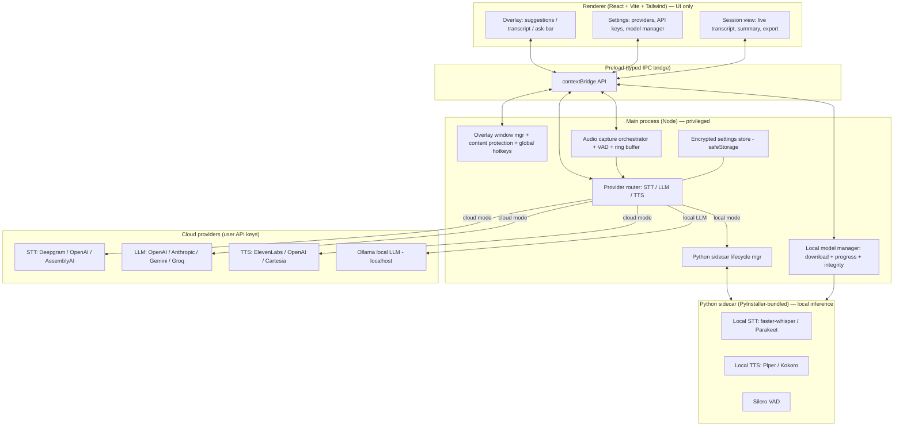

# Architecture

This document is the live technical reference for opencue. It is updated every phase.

## Goals

1. **Real-time meeting copilot** — capture meeting audio, transcribe, push context to an LLM, render assistance in an unobtrusive overlay, optionally speak responses.
2. **Two interchangeable modes** — *Cloud* (user-supplied API keys, lowest setup, highest quality) and *Local* (downloadable models, fully offline).
3. **Cross-platform** — Windows + macOS first, Linux best-effort. Per-OS native code is hidden behind adapters.
4. **Secure by default** — `contextIsolation` on, `nodeIntegration` off, strict CSP, encrypted secrets, no telemetry.

## High-level system



## Process model

opencue follows the standard hardened-Electron three-process layout:

| Process | Trust | Role | Allowed APIs |
| --- | --- | --- | --- |
| **Main** (`src/main/`) | Privileged | Window management, native APIs, IPC handlers, audio orchestration, sidecar lifecycle, provider router | Full Node + Electron |
| **Preload** (`src/preload/`) | Sandboxed bridge | Translates the typed IPC contract into a frozen `window.opencue` API exposed via `contextBridge` | Only what is needed to invoke channels |
| **Renderer** (`src/renderer/`) | Untrusted | All UI (React + Tailwind), zero native access — ESLint enforces no `electron`/`node:*` imports | Browser APIs + `window.opencue` |

`webPreferences` are: `contextIsolation: true`, `nodeIntegration: false`, `sandbox: true`, `webSecurity: true`. The renderer is served via a strict CSP that allows only `self`-served scripts.

## The IPC contract

Every cross-process call is declared once in [`src/shared/ipc-contract.ts`](../src/shared/ipc-contract.ts):

1. A channel string is added to the `IpcChannel` const-object.
2. Request/response payload shapes are added to `IpcContract`.
3. A handler is registered in `src/main/ipc.ts` (the main process).
4. The channel is exposed through the preload bridge in `src/preload/index.ts`.
5. The corresponding method is added to the `OpencueBridge` interface so the renderer gets full typing on `window.opencue`.

There are no ad-hoc string channels anywhere else — `grep` for `ipcRenderer.invoke` and `ipcMain.handle` should hit only these two files.

## Audio pipeline (planned — Phase 2)

```text
SystemAudioCapture (per-OS adapter)
        │
        ▼
   raw PCM frames ──► Silero VAD ──► speech segments
                                          │
                                          ▼
                                   ring buffer + transcript window
                                          │
                                          ▼
                              STT provider (cloud stream or local sidecar)
```

Per-OS implementations:

- **Windows** — WASAPI loopback (capture the system mix).
- **macOS** — ScreenCaptureKit audio (macOS 13+) via `desktopCapturer` / `getDisplayMedia` with `chromeMediaSource: 'desktop'`. On older macOS we fall back to a documented BlackHole / Loopback virtual audio device.
- **Linux** — PulseAudio / PipeWire monitor source on the active sink.

If a platform cannot do loopback (or the user denies permission), opencue falls back to mic + single-tab capture and tells the user clearly. The picker UI lets the user select source(s) at runtime.

## Provider abstraction (planned — Phase 3)

```text
STTProvider  ─┐
LLMProvider  ─┼─►  Router (reads encrypted settings) ─► active backend
TTSProvider  ─┘
```

Each provider is implemented behind an interface. Switching cloud ↔ local is a runtime setting change; no restart required. Provider selection plus model name plus API key are stored encrypted via Electron `safeStorage` on top of `electron-store`.

## Local inference sidecar (planned — Phase 4)

A small **Python sidecar** runs locally and exposes a localhost WebSocket / JSON-RPC. The main process owns its lifecycle (spawn, health-check, graceful shutdown). It loads:

- **faster-whisper** & **NVIDIA Parakeet** for STT,
- **Piper** & **Kokoro** for TTS,
- **Silero** for VAD.

Models are not bundled. The main-process **model manager** downloads them on demand, streams real progress (bytes / total / speed / ETA) to the renderer, verifies checksums, and stores them under the app's user-data directory.

> Parakeet is an ASR (speech-to-text) family, so it appears under STT — not TTS. The model manager treats every model uniformly; this only affects which dropdown the model is offered in.

## Security model

- **No secrets in the repo.** `.env.example` only; real `.env` is git-ignored. User API keys live in encrypted settings; they are never logged and never sent to any server we control.
- **Strict CSP** on the renderer (see `src/renderer/index.html`).
- **IPC input validation** — every handler validates its payload before acting.
- **Overlay content protection** — `BrowserWindow.setContentProtection(true)` so the overlay is excluded from screen capture / recording (Phase 1).

## Build & release (planned — Phase 7)

`electron-builder` produces Windows (NSIS), macOS (dmg), and Linux (AppImage / deb) artifacts in CI. The Python sidecar is bundled per-platform via PyInstaller. `electron-updater` ships updates from GitHub Releases. Signing & notarization steps are documented in `README.md` and `CONTRIBUTING.md`.

## Repository layout

```
.
├── docs/
│   ├── ARCHITECTURE.md     # this file
│   └── BUILD_PROMPT.md     # the master spec
├── src/
│   ├── main/               # Electron main process (privileged)
│   │   ├── index.ts
│   │   └── ipc.ts
│   ├── preload/            # contextBridge — ONLY path to the renderer
│   │   └── index.ts
│   ├── renderer/           # React UI — no Node access
│   │   ├── index.html
│   │   └── src/
│   │       ├── App.tsx
│   │       ├── main.tsx
│   │       ├── index.css
│   │       └── env.d.ts
│   └── shared/             # types shared by main, preload, renderer
│       ├── ipc-contract.ts
│       └── constants.ts
├── .github/workflows/      # CI matrix (Windows + macOS + Linux)
├── electron.vite.config.ts
├── tsconfig.json           # renderer + shared (strict)
├── tsconfig.node.json      # main + preload + tooling (strict)
└── package.json
```
