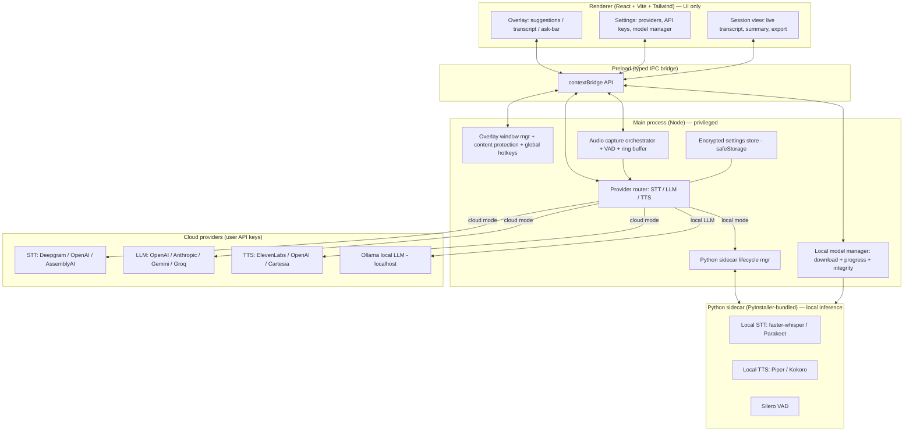

# Copilot Build Spec — Open-Source Meeting Copilot (Cluely-style desktop app)

> **How to use this file (for you, the human):** Paste this entire document to GitHub Copilot (Agent mode) as the master spec. Tell it: *"Follow this spec exactly, phase by phase. Do not skip the validation gate. Push to `main` only after the gate passes."* Run it one phase at a time. Review each PR/commit before approving the next phase.
>
> **Repo:** `github.com/mudassar531/<REPO_NAME>` (token already configured with create/push rights).
> **App name placeholder:** `<APP_NAME>` — default to `opencue` for package names; pick a final display name later.

---

## ROLE & GROUND RULES (read fully before writing any code)

You are a senior desktop-app engineer. You are building an **open-source, cross-platform Electron desktop application** that acts as a real-time meeting copilot: it listens to meeting audio, transcribes it, feeds context to an LLM, and surfaces live answers/notes in an always-on-top overlay — with the option to run everything through the user's own API keys **or** fully locally with downloadable models.

**This is a desktop app, not a webapp.** The signature features (system/loopback audio capture, an always-on-top overlay that is excluded from screen-share/recording, screen reading, native local-model inference) are impossible in a browser sandbox. Do not propose a Vercel/Render web build for the core app.

**Non-negotiable working loop for EVERY phase:**
1. **THINK** — Restate the phase goal, list the files you will create/modify, and the exact acceptance criteria. Flag any architectural risk before coding.
2. **CODE** — Implement only that phase's scope. Keep modules small and typed. No TODO stubs in shipped paths.
3. **VALIDATE** — Run the full validation gate (below). Fix until green. Manually smoke-test the phase's user-facing behavior and describe what you observed.
4. **PUSH** — Only when the gate is green: commit with a Conventional Commit message and push to `main`. Then summarize what shipped and what's next.

**Validation gate (must pass before any push to `main`):**
- `npm run typecheck` — zero TypeScript errors.
- `npm run lint` — zero ESLint errors (warnings allowed but minimized).
- `npm run build` — production build succeeds for the current OS.
- `npm test` — unit tests for any pure logic added this phase pass.
- App launches without console errors and the phase's feature demonstrably works.

**Persist the plan:** In Phase 0 you will save this whole document into the repo as `docs/BUILD_PROMPT.md`. Treat that file as the single source of truth and re-read it at the start of every phase. Keep it updated whenever the plan changes.

**Global engineering standards:**
- TypeScript everywhere (strict mode). No `any` without a written justification comment.
- Clear separation: **main process** (privileged/native), **preload** (typed IPC bridge, `contextIsolation: true`, `nodeIntegration: false`), **renderer** (UI only, no Node).
- All cross-process calls go through a single typed IPC contract file. No ad-hoc `ipcRenderer` strings scattered around.
- **Never commit secrets.** API keys are entered by the user at runtime and stored encrypted via Electron `safeStorage`. `.env.example` only; real `.env` git-ignored.
- Provider-agnostic design: STT, LLM, and TTS each sit behind an interface so cloud and local backends are swappable at runtime from settings.
- Every phase updates `README.md` and `docs/ARCHITECTURE.md` to match reality.
- Cross-platform from day one (Windows + macOS first, Linux best-effort). Where native behavior differs by OS, isolate it behind a platform adapter and document the per-OS approach.
- Conventional Commits (`feat:`, `fix:`, `chore:`, `docs:`, `refactor:`). One coherent commit per phase (or a short logical series).

---

## HIGH-LEVEL SYSTEM ARCHITECTURE

**Data flow (one cycle):** capture meeting audio → VAD segments speech → STT (cloud stream or local) → rolling transcript + context buffer → on hotkey *or* auto-trigger, send transcript (+ optional screen capture) to LLM → render suggestion card in overlay → optional TTS playback. The overlay window has content protection enabled so it does not appear in the user's shared screen or recordings.

**Recommended stack (use latest stable versions; do not hardcode old ones):**
- Shell: **Electron** + **electron-vite** (or Vite) + **electron-builder**.
- UI: **React + TypeScript + Tailwind CSS**, lightweight state (Zustand).
- Settings: **electron-store**; secrets encrypted with **Electron `safeStorage`**.
- Local inference: **Python sidecar** packaged with **PyInstaller**, exposing a localhost WebSocket/JSON-RPC. STT via **faster-whisper** and **NVIDIA Parakeet** (ASR); TTS via **Piper** and **Kokoro**; VAD via **Silero**.
- Cloud STT: **Deepgram** (streaming), **OpenAI Whisper**, **AssemblyAI**. LLM: **OpenAI**, **Anthropic**, **Google Gemini**, **Groq**, and **Ollama** for local LLM. TTS: **ElevenLabs**, **OpenAI**, **Cartesia**.
- CI: **GitHub Actions** (typecheck + lint + build matrix).

> **Note on "Parakeet":** Parakeet is NVIDIA's **speech-to-text (ASR)** family, so it belongs under STT, not TTS. For local **TTS**, use Piper/Kokoro. The model manager treats both uniformly (downloadable assets with progress), so this only affects which dropdown each model appears under.

> **Hardest part — be honest and rigorous:** system/loopback audio capture is OS-specific. Windows: WASAPI loopback. macOS: ScreenCaptureKit audio (macOS 13+) via `desktopCapturer`/`getDisplayMedia` with system-audio, or a virtual audio device fallback. Linux: PulseAudio/PipeWire monitor source. Implement behind a `SystemAudioCapture` adapter with a per-OS implementation; if a platform can't do loopback, fall back to mic + single-tab capture and tell the user clearly.

---

## PHASES

For each phase: do THINK → CODE → VALIDATE → PUSH. Do not start the next phase until the previous is on `main` and green.

### Phase 0 — Repo, scaffolding & CI
**Goal:** A typed Electron + Vite + React + Tailwind app that launches to an empty window, with linting, typechecking, tests, and CI wired.
**Tasks:**
- Initialize the repo `mudassar531/<REPO_NAME>` with MIT license, `.gitignore`, `.editorconfig`, `README.md`, `docs/ARCHITECTURE.md` (with the diagram above).
- **Save this entire build spec verbatim into the repo as `docs/BUILD_PROMPT.md`** (the document you are reading now). This is the project's source of truth. Commit it in Phase 0, and at the start of every later phase re-read it from this file before working. If scope changes during the build, update `docs/BUILD_PROMPT.md` in the same commit so it always reflects the current plan.
- Scaffold electron-vite project: `main/`, `preload/`, `renderer/`. Strict TS, ESLint, Prettier, Vitest.
- Define the **typed IPC contract** file (empty channels for now) and the `contextBridge` preload pattern with `contextIsolation: true`.
- Add npm scripts: `dev`, `build`, `typecheck`, `lint`, `test`.
- Add `.github/workflows/ci.yml` running typecheck + lint + build on push/PR (Windows + macOS + Linux matrix).
**Acceptance:** `npm run dev` opens a window; gate is green; CI passes on `main`.

### Phase 1 — Overlay window & global hotkeys
**Goal:** The signature overlay shell.
**Tasks:**
- Frameless, transparent, always-on-top, movable, resizable overlay `BrowserWindow`.
- Enable `setContentProtection(true)` so the overlay is excluded from screen capture/recording; expose a settings toggle.
- Global hotkeys (configurable): show/hide overlay, move overlay, "Assist" trigger, "Recap", open ask-bar. Use Electron `globalShortcut`.
- Encrypted settings store scaffold (`safeStorage` + electron-store) for hotkey config and toggles.
- Click-through option and opacity control.
**Acceptance:** Overlay floats over other apps, toggles via hotkey, and does **not** appear when you screen-share/record (manually verify on your OS). Gate green. Push.

### Phase 2 — Audio capture pipeline
**Goal:** Reliable meeting-audio input.
**Tasks:**
- `SystemAudioCapture` adapter with per-OS implementations (WASAPI loopback / ScreenCaptureKit / PipeWire monitor) + mic capture + single-tab capture option.
- Integrate **Silero VAD** to segment speech; ring buffer of recent audio; emit normalized PCM chunks over IPC.
- Live input-level meter and source picker in the UI (system audio vs mic vs specific tab).
- Document per-OS setup/permissions clearly in README (e.g., macOS screen-recording permission for system audio).
**Acceptance:** Selecting a source shows live levels; speech is segmented; chunks reach the main process. Graceful fallback message if loopback unsupported. Gate green. Push.

### Phase 3 — Provider abstraction + cloud STT / LLM / TTS (API-key mode)
**Goal:** End-to-end copilot using the user's own keys.
**Tasks:**
- Define `STTProvider`, `LLMProvider`, `TTSProvider` interfaces + a runtime **router** selecting the active backend from settings.
- Settings UI: add/test/store API keys (encrypted via `safeStorage`), pick provider + model per category.
- Implement cloud STT streaming (Deepgram + OpenAI Whisper + AssemblyAI), LLM (OpenAI + Anthropic + Gemini + Groq), TTS (ElevenLabs + OpenAI).
- Wire the loop: audio → STT → rolling transcript view → on "Assist" hotkey, send transcript context to LLM → render suggestion card → optional TTS playback.
- Robust error/timeout/rate-limit handling surfaced in the UI.
**Acceptance:** With a valid key, speaking produces a live transcript and a relevant suggestion on hotkey, optionally spoken via TTS. Keys are stored encrypted, never logged, never committed. Gate green. Push.

### Phase 4 — Python sidecar + local models with download progress
**Goal:** Fully local, offline-capable mode.
**Tasks:**
- Build a **Python sidecar** (PyInstaller-bundled) exposing a localhost WebSocket/JSON-RPC; managed lifecycle from main (spawn/health-check/shutdown).
- **Local model manager:** curated registry of downloadable models (local STT: faster-whisper sizes + **Parakeet**; local TTS: **Piper**, **Kokoro**). List, download, verify checksum, delete; store under app data dir.
- Stream **real download progress** (bytes/total, %, speed, ETA) to the renderer; show per-model progress bars, cancel/resume.
- Local STT + local TTS implementations behind the Phase 3 interfaces; detect **Ollama** for local LLM and list its models.
- Auto-pick CPU/GPU where available; clear messaging on requirements.
**Acceptance:** User selects a local model → sees live download progress → after download, the same copilot loop runs fully offline. Switching between cloud and local at runtime works. Gate green. Push.

### Phase 5 — Screen context ("ask about your screen")
**Goal:** Multimodal in-the-moment help.
**Tasks:**
- On-demand screen/region capture (respecting the overlay's own content-protection so it isn't captured).
- Ask-bar modes: "What should I say?", "Recap so far", and free-form "Ask a question" — combining transcript + optional screenshot for multimodal LLMs.
- Graceful degradation to transcript-only for text-only models.
**Acceptance:** Triggering ask-bar with a screenshot yields a context-aware answer; recap summarizes the session. Gate green. Push.

### Phase 6 — Meeting integrations, sessions & export
**Goal:** Make it a real workflow tool.
**Tasks:**
- "Connect a Google Meet tab / window" flow for audio source selection; session start/stop with persisted transcript + suggestions history.
- Post-meeting summary + action items; export to Markdown and copy-to-clipboard (Notion-friendly).
- Onboarding/first-run wizard (permissions, pick mode, optional model download).
- Settings polish, theming, accessibility pass.
**Acceptance:** A full session can be started, transcribed, assisted, summarized, and exported. Gate green. Push.

### Phase 7 — Packaging, auto-update & release
**Goal:** Shippable open-source binaries.
**Tasks:**
- `electron-builder` config for Windows (NSIS), macOS (dmg), Linux (AppImage/deb), bundling the Python sidecar correctly per platform.
- Document code-signing/notarization steps (note unsigned-build caveats for contributors).
- GitHub Actions release workflow: build matrix → attach installers to a **GitHub Release** on tag push. Wire `electron-updater` for auto-update from GitHub Releases.
- Finalize README (features, install, build-from-source, privacy/ethics note), `CONTRIBUTING.md`, screenshots/GIF.
**Acceptance:** Tagging `v0.1.0` produces downloadable installers on the Releases page; a fresh install runs the full flow. Gate green. Push + tag.

---

## CROSS-CUTTING REQUIREMENTS
- **Privacy & ethics:** Add a clear README section. Local mode keeps audio on-device. Default to a visible recording/active indicator; do not market the screen-share-invisibility as an interview-cheating feature — frame it as a personal assistance overlay. Respect that some environments prohibit such tools.
- **Security:** `contextIsolation` on, `nodeIntegration` off, strict CSP in renderer, validate all IPC inputs, encrypt secrets, never log keys or raw audio.
- **Performance:** stream don't batch where possible; cap context buffer; debounce LLM calls; release audio buffers promptly.
- **Testing:** unit-test pure logic (VAD segmentation, context buffer, provider router selection, model-registry integrity). Mock providers in tests — no live API calls in CI.
- **Docs stay current:** every phase updates `ARCHITECTURE.md` and `README.md`.

**Begin with Phase 0 now.** Start by THINKING: restate the goal, list files, confirm the stack versions you'll use today, then code. Do not push until the validation gate is green.
